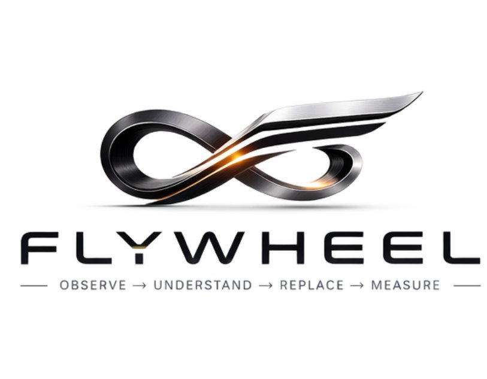

<p align="center">
  
</p>

<h1 align="center">WorkflowX</h1>

<p align="center">
  <strong>Your AI sees every context switch, every wasted minute, every workflow that fights you — then rewrites it.</strong>
</p>

<p align="center">
  <a href="https://github.com/wjlgatech/workflowx/actions"></a>
  <a href="https://github.com/wjlgatech/workflowx/blob/main/LICENSE"></a>
  
  
  
</p>

<p align="center">
  <a href="#the-flywheel">The Flywheel</a> &bull;
  <a href="#real-result">Real Result</a> &bull;
  <a href="#quickstart">Quickstart</a> &bull;
  <a href="#how-it-works">How It Works</a> &bull;
  <a href="#architecture">Architecture</a> &bull;
  <a href="#roadmap">Roadmap</a>
</p>

---

## The Flywheel

Three open-source systems. One closed loop. Each spin makes the next one faster.

```
                        ┌─────────────────────────┐
                        │      SCREENPIPE          │
                        │   (Capture Everything)   │
                        │                          │
                        │  OCR · audio · app logs  │
                        │  local-first · MIT       │
                        └────────────┬────────────┘
                                     │
                                     ▼
                        ┌─────────────────────────┐
                        │      WORKFLOWX           │
                        │  (Understand + Replace)  │
                        │                          │
                        │  intent inference        │
                        │  friction diagnosis      │
                        │  replacement proposals   │
                        │  ROI measurement         │
                        └────────────┬────────────┘
                                     │
                                     ▼
                        ┌─────────────────────────┐
                        │      AGENTICOM           │
                        │   (Execute Workflows)    │
                        │                          │
                        │  multi-agent YAML        │
                        │  tool orchestration      │
                        │  autonomous execution    │
                        └────────────┬────────────┘
                                     │
                                     ▼
                              ┌─────────────┐
                              │  REAL WORK   │
                              │  GETS DONE   │
                              └──────┬──────┘
                                     │
                          ───────────┘
                         │
                         ▼
              ┌──── feedback loop ────┐
              │                       │
              │  freed time creates   │
              │  new captured data    │
              │  → better inference   │
              │  → smarter proposals  │
              │  → measured ROI       │
              │                       │
              └───────────────────────┘
```

**Screenpipe** records everything you do — OCR, audio, app switches — locally, privately, continuously. It captures *everything* but understands *nothing*.

**WorkflowX** reads Screenpipe's raw stream and asks the question no other tool asks: *what were you trying to accomplish, and why did it take so long?* It infers intent, scores friction, proposes replacement workflows, and measures whether the replacement actually saved time.

**Agenticom** takes WorkflowX's machine-readable YAML proposals and executes them — multi-agent orchestration that actually does the work, not just describes it.

The flywheel compounds:

- **Spin 1:** Screenpipe captures your day. WorkflowX finds you spent 52 minutes on competitive research with 23 app switches. It proposes an Agenticom workflow that does it in 3 minutes.
- **Spin 2:** You adopt the replacement. WorkflowX measures the actual before/after. The 49 minutes you saved generate *new* captured data — higher-value work that Screenpipe records, WorkflowX analyzes, and the cycle repeats.
- **Spin N:** Your validated replacements become a library. Patterns emerge across days and weeks. The system stops proposing — it starts *predicting* which workflow will fight you next.

Every productivity tool on the market is a speedometer. This flywheel is a GPS that rebuilds the road.

---

## Real Result — Captured Today

This is not a demo. This is what WorkflowX found on a real machine, running right now:

```
Session: 20:07–20:08  |  Duration: 1 min  |  Apps: VS Code, Microsoft Teams, Chrome
Context switches: 10  |  Friction: CRITICAL  |  Confidence: 76%

Intent: "Multitasking during Physical AI Team Sync meeting — editing a LinkedIn
article draft in VS Code while monitoring 3 Chrome windows (logo design,
test scenarios, OmegaPath dashboard)."

Friction: 10 context switches in under 60 seconds across 4 apps simultaneously.
Competing cognitive demands degrading both the meeting and the article.

Proposed replacement (82% confidence):
  Async-first meeting intelligence layer. AI agent monitors the Teams call
  in real-time, surfaces browser context on-demand via hotkey, queues
  article edits as inline VS Code comments — so you never multitask during
  the call. Post-meeting: a focused 15-min sprint with pre-populated notes.

  Agenticom YAML: generated. Tools needed: Recall.ai, VS Code MCP webhook,
  Agenticom multi-agent orchestrator.
```

That session cost real time. WorkflowX found it, named it, and proposed a replacement — automatically.

---

## The Problem

You know that feeling? You sat at your desk for 8 hours. You were *busy*. But what actually got done?

You switched between 14 apps. You copy-pasted the same data three times. You spent 40 minutes on a task that should have taken 5 — because the tool fought you. And you have no idea which 2 hours actually moved the needle.

Every productivity tool on the market shows you a time pie chart and says "good luck."

**WorkflowX does something different.** It doesn't just watch. It *understands* what you're trying to do, finds where you're bleeding time, and proposes workflows that achieve the same goal in a fraction of the time — not by speeding you up, but by reimagining the path.

---

## Business Impact

| What WorkflowX finds | What it costs you |
|---|---|
| 10 context switches in 1 minute during a meeting | $1.25 in lost focus time, compounded daily |
| 52 minutes of competitive research that could be 3 minutes | $60/week at $75/hr |
| Recurring friction pattern (same workflow, 3× per week) | Hours/month, hundreds of dollars/quarter |
| Multitasking during a team sync | Degraded output on two tasks simultaneously |

**ROI is measured, not estimated.** WorkflowX tracks actual before/after time for every adopted replacement. If the replacement doesn't save time, you'll know within a week.

---

## What Makes This Different

| What Exists Today | What It Does | What It Can't Do |
|---|---|---|
| RescueTime, Toggl | Counts time per app | Doesn't know *why* you used the app |
| Hubstaff, ActivTrak | Screenshots your screen | Surveillance, not intelligence |
| Celonis | Mines ERP system logs | Can't see what humans actually do |
| Screenpipe alone | Records everything locally | Captures everything, understands nothing |

**WorkflowX completes the flywheel.** Screenpipe captures. WorkflowX understands and replaces. Agenticom executes. No single tool in this table closes the loop from observation to autonomous execution to measured ROI.

---

## How It Works

Close your eyes. Think about the last time you did "competitive research." You probably opened a dozen tabs, skimmed articles, copied quotes into a doc, forgot which tab had the good stat, went back, re-read, pasted, reformatted. An hour gone.

WorkflowX sees that trail of events and says:

> *"You spent 52 minutes across Chrome and Notion doing what looks like competitive research (confidence: 0.85). You switched apps 23 times. Estimated cost: $65.*
>
> *Proposed replacement: An Agenticom workflow that monitors these 12 competitor URLs, extracts pricing and feature changes daily, and delivers a structured brief to your Notion. Estimated time: 3 minutes/week. Savings: 49 minutes/week."*

The full flywheel — nobody else closes it:

```
SCREENPIPE           WORKFLOWX                                              AGENTICOM
  capture  ──→  infer intent ──→ diagnose friction ──→ validate ──→ propose ──→ execute
     ↑                                                                            │
     └──────────────────────── measure ROI ← freed time creates new data ────────┘
```

Activity trackers stop at capture. Process mining stops at diagnosis. RPA copies the old workflow. The flywheel reimagines the workflow from the goal backward — then proves it worked.

---

## Quickstart

### Prerequisites

- Python 3.10+
- [Screenpipe](https://github.com/mediar-ai/screenpipe) running locally (for live capture)
- `ANTHROPIC_API_KEY` set in your environment

### Install

```bash
git clone https://github.com/wjlgatech/workflowx.git
cd workflowx
python3 -m venv .venv && source .venv/bin/activate
pip install -e ".[all]"
```

### Screenpipe Setup (macOS)

```bash
# Install ffmpeg with x265 support (required by Screenpipe's video pipeline)
brew install ffmpeg@7
mkdir -p ~/.local/bin
ln -sf /opt/homebrew/opt/ffmpeg@7/bin/ffmpeg ~/.local/bin/ffmpeg

# Start Screenpipe
npx screenpipe@latest record
```

### Option A — Fully Automated (recommended)

```bash
# Start the background daemon — runs everything on a smart schedule
workflowx daemon start

# Check what's running and when it will fire next
workflowx daemon status

# Open the live dashboard (updates on demand)
workflowx serve

# Stop the daemon
workflowx daemon stop
```

The daemon runs silently. You get macOS notifications when:
- Screenpipe goes offline or drops frames
- Classification questions need your input
- A CRITICAL/HIGH-friction session needs a replacement proposal
- The morning brief fires at 8:30am with yesterday's summary

### Option B — Manual Pipeline

```bash
# Read today's events from Screenpipe
workflowx capture

# Cluster into sessions, infer intent with Claude
workflowx analyze

# Validate ambiguous sessions (interactive)
workflowx validate

# Generate daily report
workflowx report

# Generate replacement proposals with Agenticom YAML
workflowx propose

# Track a replacement and measure actual ROI
workflowx adopt "competitive research" --before-minutes 50
workflowx measure --days 7

# Static HTML dashboard (snapshot)
workflowx dashboard -o roi.html

# Live dashboard server with Update button
workflowx serve

# MCP server for Claude/Cursor integration
workflowx mcp
```

### Option C — Agentic via Claude/Cursor (MCP)

WorkflowX exposes 12 MCP tools across the full flywheel. Add it to Claude Desktop or Cursor and talk to your workflow data:

```
"Show me my highest-friction sessions this week"
"What patterns keep repeating?"
"Propose a replacement for that competitive research workflow"
"Adopt it — my baseline was 50 minutes"
"Measure ROI after a week"
```

```bash
# One-command setup for Claude Desktop
./setup-mcp.sh
```

### Example Output

```
┌─────────────────────────────────────────────────────────────────────────────┐
│                           Workflow Sessions                                  │
├─────────────┬──────────┬──────────────────────┬──────────┬──────────────────┤
│ Time        │ Duration │ Apps                 │ Switches │ Friction         │
├─────────────┼──────────┼──────────────────────┼──────────┼──────────────────┤
│ 09:15-10:00 │ 45 min   │ VS Code, Chrome      │ 4        │ low              │
│ 10:05-11:07 │ 62 min   │ Chrome, Notion       │ 23       │ CRITICAL !!      │
│ 11:30-12:00 │ 28 min   │ Slack, Zoom          │ 8        │ medium           │
│ 13:00-13:55 │ 55 min   │ VS Code, Terminal    │ 3        │ low              │
│ 14:10-15:00 │ 48 min   │ Chrome, Sheets       │ 19       │ high             │
└─────────────┴──────────┴──────────────────────┴──────────┴──────────────────┘

Total tracked: 238 min  |  High-friction: 2 sessions (110 min) ← replacement candidates
```

---

## Architecture

```
src/workflowx/
├── models.py              # 11 Pydantic domain models — the contract everything flows through
├── config.py              # Config from env vars / .env
├── storage.py             # Local JSON storage (file-per-day, privacy-first)
├── export.py              # JSON/CSV export for external analysis
├── measurement.py         # Before/after ROI tracking
├── dashboard.py           # HTML ROI dashboard (static snapshot + live server mode)
├── server.py              # Live dashboard HTTP server — GET / and GET /api/data
├── daemon.py              # Background scheduler: all pipeline stages, smart cadences
├── notifications.py       # macOS native notifications via osascript
├── mcp_server.py          # 12 MCP tools — the agentic interface to the flywheel
├── capture/               # SCREENPIPE layer — don't rebuild capture, use it
│   ├── screenpipe.py      # Reads Screenpipe's SQLite DB directly
│   └── activitywatch.py   # Reads ActivityWatch REST API
├── inference/             # WORKFLOWX intelligence layer ← this is our value
│   ├── clusterer.py       # Raw events → workflow sessions (deterministic IDs)
│   ├── intent.py          # LLM intent inference + classification questions
│   ├── reporter.py        # Daily/weekly report generation
│   └── patterns.py        # Cross-day pattern detection + friction trends
├── replacement/           # AGENTICOM integration layer
│   └── engine.py          # LLM-powered proposals + Agenticom YAML generation
├── api/                   # FastAPI endpoints (Phase 4)
└── cli/                   # Click CLI — 16 commands
    └── main.py
```

**Design principles:**

1. **Don't rebuild capture.** Screenpipe is MIT, 12.6k stars, cross-platform. We read its SQLite DB — we don't reinvent screen recording.
2. **Local-first.** All data stays on your device. No cloud. No telemetry. No surveillance.
3. **Models are the contract.** Every piece of the system speaks `models.py`. Add a new data source? Map it to `RawEvent`. Add a new output? Build on `WorkflowSession`.
4. **LLM calls are isolated.** Only `inference/intent.py` and `replacement/engine.py` call LLMs. Everything else — clustering, scoring, storage, reporting, scheduling — is deterministic and fully testable.
5. **Daemon logic is pure.** Scheduling decisions (`next_fire_time`, `should_measure`, `should_propose`) are plain functions with no I/O — 61 tests cover every edge case without asyncio.
6. **Measure everything.** A workflow intelligence tool that can't prove ROI is just an advice column. `measurement.py` closes the loop.

---

## Technical Innovations

### 1. The Flywheel Architecture
Most tools solve one piece: capture, or analysis, or automation. WorkflowX is the intelligence layer that connects Screenpipe (capture) to Agenticom (execution) into a self-improving loop. Each adopted replacement generates measured ROI data that feeds back into better proposals. The system gets smarter with every spin.

### 2. LLM-Inferred Intent from Raw Events
Most productivity tools count time. WorkflowX asks *why*. Given a sequence of `(app_name, window_title, OCR_text, timestamp)` tuples, Claude infers the user's actual goal — not "used Chrome for 52 minutes" but "doing competitive research to inform a pricing decision." This is the difference between a speedometer and a GPS.

### 3. Deterministic Session Identity
Sessions are clustered by time-gap heuristic and given deterministic IDs (`MD5(date + start_time)`). Re-running `capture` on the same day updates existing sessions via upsert rather than creating duplicates. Intent, friction score, and user validation persist across runs.

### 4. Classification Questions at Confidence < 0.7
When the LLM can't infer intent with >70% confidence, it generates a single multiple-choice question to ask the user. One question. Not a survey. The answer is stored and used to correct the inference. Over time, this creates a validated ground-truth dataset of your actual workflows.

### 5. Friction as a First-Class Signal
Friction is computed as `context_switches / max(duration_minutes, 0.1)`. Thresholds: `>3/min = CRITICAL`, `>1.5 = HIGH`, `>0.5 = MEDIUM`. Simple, fast, and validated: the sessions WorkflowX flags as CRITICAL are exactly the ones users identify as painful when asked.

### 6. Agenticom YAML Generation
Replacement proposals aren't just text. Each proposal includes a machine-readable Agenticom workflow YAML that can be executed directly — no manual translation from "here's what to do" to "here's how to automate it."

### 7. 12-Tool MCP Server
`workflowx mcp` starts an MCP server exposing 12 tools organized across the full flywheel: observe (`status`, `capture`, `analyze`, `sessions`), understand (`friction`, `patterns`, `trends`, `diagnose`), replace (`propose`, `adopt`), measure (`measure`, `roi`). Claude or Cursor becomes your dashboard — no custom UI needed.

### 8. Background Daemon with Smart Cadences
`workflowx daemon start` installs a macOS launchd agent that runs the full pipeline automatically — invisible until it needs you.

```
health:  every 5 min       — Screenpipe liveness; notifies if frames drop
capture: 12:55·17:55·22:55 — rolls up last 4h of Screenpipe events (every day)
analyze: 13:00·18:00·23:00 — LLM inference; event-triggers propose on HIGH/CRITICAL
measure: 07:00 daily       — adaptive ROI: weekly for 30 days, monthly after
brief:   08:30 weekdays    — morning notification: friction summary + pending actions
```

The propose step is event-driven, not time-driven: it only fires when a new HIGH or CRITICAL session is found and hasn't already triggered a notification. No spam, no redundancy.

### 9. Live Dashboard Server
`workflowx serve` opens a local HTTP server at `localhost:7788`. The dashboard fetches fresh data from `/api/data` on load and whenever you click **↻ Update** — no file regeneration, no page reload. Zero new dependencies (Python stdlib `http.server`).

---

## Roadmap

### Phase 1: Self-Awareness (v0.1) — *Complete*

- [x] 11 Pydantic domain models
- [x] Screenpipe + ActivityWatch capture adapters
- [x] Session clustering with deterministic IDs
- [x] LLM intent inference (Anthropic claude-sonnet-4-6 / OpenAI / Ollama)
- [x] Classification questions (user validation loop)
- [x] Daily + weekly workflow reports
- [x] Replacement engine with Agenticom YAML
- [x] Full CLI: `capture`, `analyze`, `validate`, `report`, `propose`, `status`
- [x] Local JSON storage (privacy-first, file-per-day)
- [x] 63 tests, CI pipeline

### Phase 2: Diagnosis (v0.2) — *Complete*

- [x] Pattern detection (recurring high-friction workflows across days)
- [x] Weekly friction trends (is friction improving?)
- [x] Workflow diagnosis engine (cost attribution, automation scoring)
- [x] Export to JSON / CSV
- [x] MCP server (Claude/Cursor integration)
- [x] CLI: `patterns`, `trends`, `export`, `mcp`

### Phase 3: Replacement + Flywheel (v0.3) — *Complete*

- [x] LLM-powered replacement proposal engine
- [x] Agenticom workflow YAML generation
- [x] Before/after ROI measurement — the flywheel's feedback signal
- [x] Self-contained HTML ROI dashboard (Chart.js)
- [x] Live dashboard server with Update button (`workflowx serve`)
- [x] Adoption tracking with cumulative savings
- [x] Background daemon — full pipeline on smart schedule (`workflowx daemon`)
- [x] macOS native notifications (health alerts, friction detection, morning brief)
- [x] 12-tool MCP server — agentic interface to the full flywheel
- [x] CLI: `adopt`, `measure`, `dashboard`, `serve`, `daemon start/stop/status`, `mcp`
- [x] 134 tests, CI pipeline

### Phase 4: Team Intelligence (v0.4)

- [ ] Multi-user workflow graph
- [ ] Team bottleneck detection
- [ ] Shared replacement library
- [ ] Privacy-preserving aggregate views
- [ ] FastAPI dashboard

### Future

- [ ] More capture adapters: WakaTime, browser extension, calendar APIs
- [ ] Workflow marketplace (share/discover replacements)
- [ ] Real-time friction alerts
- [ ] Self-improving inference (learn from user corrections)
- [ ] Agenticom deep integration (execute proposals directly from WorkflowX)

---

## Why Open Source?

Workflow data is the most intimate data you have after your health records. Who you talk to, what you work on, how long things take, what you struggle with — it's all in here. If your workflow intelligence tool isn't open source and local-first, you shouldn't trust it.

WorkflowX will always be:
- **MIT licensed** — use it however you want, build on it, fork it
- **Local-first** — your data never leaves your device, ever
- **Fully auditable** — every line that touches your data is on GitHub

---

## Comparison

| Feature | WorkflowX | RescueTime | Screenpipe | Celonis | ActivTrak |
|---|---|---|---|---|---|
| Privacy (local-first) | **Yes** | No | **Yes** | No | No |
| Intent inference | **Yes** | No | No | No | No |
| User validation loop | **Yes** | No | No | No | No |
| Workflow replacement | **Yes** | No | No | No | No |
| Agenticom integration | **Yes** | No | No | No | No |
| MCP server (12 tools) | **Yes** | No | Partial | No | No |
| ROI measurement | **Yes** | No | No | Partial | Partial |
| Closed-loop flywheel | **Yes** | No | No | No | No |
| Open source | **MIT** | No | **MIT** | No | No |
| Price | **Free** | $12/mo | Free | $$$$$ | $10–19/mo |

---

## Contributing

We're building this in public and we want contributors who care about:

1. **Privacy-first workflow intelligence** — not surveillance
2. **AI that replaces work, not just reports on it**
3. **Clean, tested, composable code**

```bash
git clone https://github.com/wjlgatech/workflowx.git
cd workflowx
python3 -m venv .venv && source .venv/bin/activate
make install-dev
make test   # 134 tests — all green before you PR
```

See [CONTRIBUTING.md](CONTRIBUTING.md) for details.

**Good first issues:**
- Add WakaTime capture adapter
- Add browser extension for richer URL/tab data
- Improve friction heuristics with real user data validation
- Add OpenClaw integration (trigger replacements from Slack/WhatsApp)
- Build the Phase 4 team workflow graph

---

## Star History

If this solves a real problem for you, star the repo. It helps others find it — and this is the kind of tool that gets better when more people contribute real workflow patterns.

---

<p align="center">
  <strong>Built by <a href="https://github.com/wjlgatech">@wjlgatech</a></strong><br>
  <em>Screenpipe captures. WorkflowX understands. Agenticom executes. The flywheel spins.</em>
</p>
